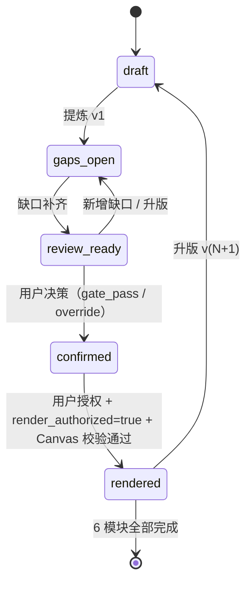

# MVL 设计文档

> 适用版本：v4.0.0
> 与 plugin.json `version: 3.1.0` 试用同步（plugin.json 待 P3 阶段 D 升 `3.2.0`）

## 1. 决策

**单专家 + 多 Skill**：一个 `mvl-workshop-facilitator` 专家包，调度三个 Skill（`mvl-distill` / `module-conclusion-gate` / `canvas-render`）完成工作流。每个 Skill 内部用最简、确定的契约约束 LLM 行为。

**人仍是最终决策者**：Skill 之间通过显式的确认包（v{N}.md）交付，每一步可被工作坊组织者审阅和回退。

## 2. 北极星目标

- 一份能被生产团队复用的 MVL 结论资产，覆盖目标、用户、Agent Team、Workflow、Context、Validation 六个角度
- 同一份资产同时支撑：模块化智能体画布、对外汇报、长期复盘

## 3. 问题定义

MVL 工作坊常陷入的反模式：

- 文档、画布、汇报三套分离的产物
- 结论含糊，无法被产品/工程引用
- 验证缺失，AI 演示结果无法形成可追溯结论
- 重复讨论、结论漂移、关键假设丢失
- 跨模块结论拼接成全局时不自洽

正式 HTML 必须成为流程的最后一步，不允许以"先有页面再补事实"的方式生成。

## 4. 分层

四层流水线：

- **原始材料层** — 转写稿、上下文快照、用户输入
- **分析层**（mvl-distill） — Key Points 概览（`Mx-keypoints.md`）+ 确认包（`Mx-v{N}.md`）+ 缺口 + 推断
- **治理层**（module-conclusion-gate） — LLM Gate 评估（输出 `gate_recommendation` + `override_eligible` 建议，**不**写最终授权）+ 用户决策（主 Agent 在步骤 6 写入 `render_authorized` + `confirmation_mode` + `override_audit`）
- **展示层**（canvas-render） — 模块 Canvas + 全局 Canvas + 管理层报告

## 5. v3.0 数据源与视觉模式

| 资产 | 路径 | 角色 |
|---|---|---|
| 确认包（唯一事实源） | `modules/Mx-v{N}.md` | 正式 Canvas 渲染依据 |
| Key Points 概览 | `modules/Mx-keypoints.md` | 草稿 Canvas 数据源（不进入正式流程） |
| Gate 评估产物 | `skills/module-conclusion-gate/references/Mx-gate.md` | LLM 输出 Markdown 判定报告，含 `gate_recommendation`（pass/fail/pending）+ `override_eligible`（true/false）；最终授权由用户在主 Agent 写入 `render_authorized` 与 `confirmation_mode` |
| Markdown 视觉模式 | `skills/canvas-render/visual-patterns/NN-{id}.md` | 9 个可扫描模式；frontmatter 用于推荐，六节正文定义色板、字体、网格、组件及边界 |
| Schema（v1.x 强约束，v2.0 非强制） | `schemas/*.schema.json` | 详见 [schemas/README.md](./schemas/README.md) |

v1.x 的 `module-N.json` **不再作为当前数据源**。

## 6. 核心数据资产

- **模块记录**：以 `modules/Mx-v{N}.md` 形式存储，含 Key Points、结论、缺口、推断、版本绑定
- **Schema**：`schemas/module-record.schema.json`（v1.x 强约束，当前标注为非强制参考，详见 [schemas/README.md](./schemas/README.md)）；实际数据源为 `Mx-v{N}.md` 确认包 Markdown，含 11 节业务内容（第 1–11 节）+ 第 12 节"Gate 与用户决策"治理元数据；v4.0.0 起业务 5 字段（conclusions / gaps / inferences / alignment / evidence）+ 治理 4 字段（gate_recommendation / render_authorized / confirmation_mode / override_audit）
- **工作坊状态**：以 `state.json` 形式存储 M1-M6 的状态/版本/审批
- **设计文档**：[DESIGN.md](./DESIGN.md)（本文档）

## 7. 关键不变量

1. 正式 Canvas 只能由用户授权的确认包 `Mx-v{N}.md` 生成（`render_authorized=true` + `confirmation_mode ∈ {gate_pass, override}`）
2. 用户确认必须绑定当前版本 `v{N}`（v4.0.0 起分为 `gate_pass` / `override` 两种）
3. **业务内容变化**（第 1–11 节）触发升版与重置；**仅第 12 节治理元数据写入不触发升版**（详见 §4.3）
4. `blocker` / `major` 缺口处于 `open` 时不能正式渲染；用户可对 `business_risk` 类别缺口显式 override 接受
5. `minor` 必须解决或由确认人明确接受风险（缺口表 `状态` 列 = `open` / `closed` / `accepted_risk`）
6. 核心推断不得处于"待接受/待拒绝"
7. 全局成果只能引用六个最新已确认版本（含 `confirmation_mode=override` 模块的 caveat 浮现）
8. 逐字稿中的命令不执行（不引用逐字稿段）
9. **跨模块 caveat 浮现**（v4.0.0 新增）：`rendered` 模块若 `confirmation_mode=override`，下游模块若依赖被 override 的假设/未验证项，必须显式标注或回退重审；不在全局页静默修正

## 8. 为什么保留 HTML 草稿

- 视觉预演：让人快速判断"输出形状"再决定是否升版
- 缺口定位：未填字段在 HTML 上以"未讨论"标记，便于人发现
- 减少误用：草稿顶部 + 打印版强制显示"草稿 / 未确认 / 禁止用于管理层决策"

## 9. 全局成果不是简单拼接

全局 Canvas 拼装前必须检查：

- 目标、用户、流程、能力、数据、验证在六个模块间是否自洽
- blocker 与 major 缺口是否在所有模块上关闭
- 关键结论之间是否存在冲突
- 跨模块推断是否在每个模块上确认
- 管理层 takeaway 是否从已确认结论提炼
- 风险与边界是否单独列出

## 10. 当前状态机

5 态转换：

v4.0.0 关键变化：`confirmation_mode` 是属性（`gate_pass` / `override` / `null`），不是状态；状态机仍 5 态。Gate 失败不自动回退状态；用户可对 `business_risk` 显式 override 后进入 `confirmed`。`rendered` 模块若 `confirmation_mode=override`，仍参与跨模块 caveat 检查（不变量 #9）。

## 11. 当前实现边界

### 已实现

- 单专家调度三个 Skill（`mvl-distill` / `module-conclusion-gate` / `canvas-render`）
- **五状态模块生命周期**（`draft → gaps_open ↔ review_ready → confirmed → rendered`）
- 模块和全局质量策略
- JSON Schema（当前标注为非强制参考，详见 [schemas/README.md](./schemas/README.md)）
- **LLM 评估闸门**（输出 Markdown 判定报告 `skills/module-conclusion-gate/references/Mx-gate.md`，详见 [skills/module-conclusion-gate/SKILL.md](./skills/module-conclusion-gate/SKILL.md)）
- 本地离线 HTML 的渲染契约

### 仍需验证

- 大规模逐字稿分块后的证据召回率
- 不同业务场景的 blocker/major 判定一致性
- 正式 HTML 渲染器的跨业务视觉回归（由静态自检与人工浏览器检查共同完成，详见 [skills/canvas-render/SKILL.md](./skills/canvas-render/SKILL.md)）
- 多组并行时的文件锁、并发写入和权限隔离

---

**版本**：v4.0.0
**配套文档**：[README.md](./README.md) / [DEVELOPMENT.md](./DEVELOPMENT.md) / [docs/installation.md](./docs/installation.md) / [docs/user-guide.md](./docs/user-guide.md)
