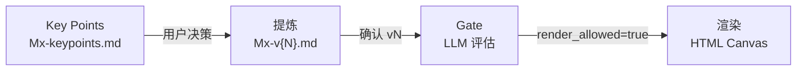

# MVL Workshop Facilitator

MVL（Multi-perspective Value Loop）工作坊引导专家包。3 天工作坊引导 + 转写提炼 + 模块化智能体画布（Canvas）生成。

详细专家定位、标签、快速指令以 `.codebuddy-plugin/plugin.json` 为权威来源。

## 核心架构



四阶段管线：先从转写中抽取 Key Points，再提炼成确认包 Markdown，通过 LLM Gate 后渲染为可下钻的 HTML Canvas。

## 模块生命周期

```text
draft → gaps_open ↔ review_ready → confirmed → rendered
```

5 态转换：草稿在 `gaps_open` 与 `review_ready` 之间反复直到全部缺口解决，然后用户确认升至 `confirmed`，最后渲染为 `rendered`（详见 `agents/mvl-workshop-facilitator.md` 的状态机章节）。

## 项目结构

```text
mvl-workshop-facilitator/
├── .codebuddy-plugin/   # 专家包元数据
├── agents/              # 主 Agent（mvl-workshop-facilitator.md）
├── skills/              # 三个 Skill：mvl-distill / module-conclusion-gate / canvas-render
│   └── canvas-render/
│       └── visual-patterns/ # 9 个 Markdown Canvas 视觉模式
├── schemas/             # v1.x 时期产物，v2.0 标注非强制参考
├── examples/modules/    # Mx-keypoints / Mx-v{N} 模板
├── docs/                # 用户文档
├── README.md            # 本文件（门面）
├── DEVELOPMENT.md       # 维护者文档
└── DESIGN.md            # 设计文档
```

## 文档导航

- [docs/installation.md](./docs/installation.md) — 部署到 WorkBuddy 的完整步骤
- [docs/user-guide.md](./docs/user-guide.md) — 3 天工作坊使用流程 + 指令速查
- [DEVELOPMENT.md](./DEVELOPMENT.md) — 维护者与 AI 助教命令清单
- [DESIGN.md](./DESIGN.md) — 设计文档（架构、不变量、状态机）

## 专家版本

v3.1.0（2026-07-30）。与 `.codebuddy-plugin/plugin.json` 的 `version` 字段同步。
