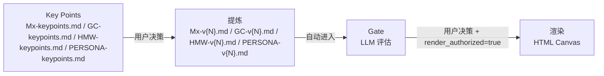

# Pratyaya Canvas Expert

> 品牌：pratyaya
> 版本：2.2.0

多画布工作坊平台——支持 **MVL**（Minimum Verifiable Loop，最小可验证自治闭环）、**黄金圈**（Golden Circle）、**HMW**（How Might We，问题重构）与**用户画像**（User Persona）四种画布类型。对话式引导 + 转写提炼 + 质量门禁 + 模块化智能体画布（Canvas）生成。

详细专家定位、标签、快速指令以 `.codebuddy-plugin/plugin.json` 为权威来源。

## 支持的画布类型

| 画布 | 结构 | 流程 |
|---|---|---|
| MVL | M1-M6 六模块 | 转写 → Key Points → 确认包 → Gate → 渲染 |
| 黄金圈 | WHY/HOW/WHAT 三层 | 同上四阶段管线 |
| HMW | 陈述四字段 + 质量鉴别 + 想法种子 | 同上四阶段管线 |
| 用户画像 | 9 基本信息 + 6 宫格 + 4 质量鉴别 | 同上四阶段管线 |

## 核心架构



四阶段管线：先从转写中抽取 Key Points，再提炼成确认包 Markdown；确认包展示后自动运行 LLM Gate，由用户决策，主 Agent 写入 `render_authorized` + `confirmation_mode`，再渲染为可下钻的 HTML Canvas。

## 模块生命周期

```text
draft → gaps_open ↔ review_ready → confirmed → rendered
```

5 态转换（MVL 模块级 / GC / HMW / Persona 画布级）：草稿在 `gaps_open` 与 `review_ready` 之间反复直到全部缺口解决，用户决策（`gate_pass` / `override`）后升至 `confirmed`，最后渲染为 `rendered`。`confirmation_mode` 是属性（`gate_pass` / `override` / `null`），不是状态；`rendered` 模块若 `confirmation_mode=override` 仍参与跨模块 caveat 检查（仅 MVL）。

## 项目结构

```text
pratyaya/
├── .codebuddy-plugin/   # 专家包元数据
├── agents/              # 主 Agent（pratyaya.md）
├── skills/              # 九个 Skill
│   ├── mvl-distill/     # MVL 提炼
│   ├── gc-distill/      # 黄金圈提炼
│   ├── hmw-distill/     # HMW 提炼
│   ├── persona-distill/ # 用户画像提炼
│   ├── module-conclusion-gate/  # MVL 门禁
│   ├── gc-gate/         # 黄金圈门禁
│   ├── hmw-gate/        # HMW 门禁
│   ├── persona-gate/    # 用户画像门禁
│   └── canvas-render/   # 统一渲染（画布类型感知）
│       └── visual-patterns/ # 10 个视觉模式（所有画布复用）
├── schemas/             # 非强制参考 Schema（v2.2 支持 GC + HMW + Persona）
├── examples/modules/    # Key Points / 确认包模板
├── scripts/             # Canvas HTML 确定性静态审计（支持 --type gc / hmw）
├── docs/                # 用户文档
├── README.md            # 本文件（门面）
├── DEVELOPMENT.md       # 维护者文档
└── DESIGN.md            # 设计文档
```

## 文档导航

- [docs/installation.md](./docs/installation.md) — 部署到 WorkBuddy 的完整步骤
- [docs/user-guide.md](./docs/user-guide.md) — 工作坊使用流程（MVL + 黄金圈 + HMW + Persona）+ 指令速查
- [DEVELOPMENT.md](./DEVELOPMENT.md) — 维护者与 AI 助教命令清单
- [DESIGN.md](./DESIGN.md) — 设计文档（架构、不变量、状态机、画布类型）

## 致谢

思想源于**北京大学汇丰商学院未来实验室**导师**檀林**老师的工作坊教学实践；初版由**王鸿**、**陈嘉杰**共同开发。

## 开源协议

本项目基于 [MIT 协议](./LICENSE) 开源。
