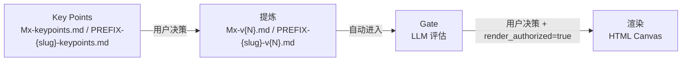

# Pratyaya Canvas Expert

> 品牌：pratyaya
> 版本：2.3.0

多画布工作坊平台——以 **MAAU 一次性综合路径**（把一次性逐字稿直接综合为 MVL 全局画布的六板块源包）为**默认方式**，并提供 **MVL M1-M6 六模块管线**（分步备选路径，须显式声明启用）以及 **黄金圈**（Golden Circle）、**HMW**（How Might We，问题重构）、**用户画像**（User Persona）与 **用户旅程**（User Journey）画布。对话式引导 + 转写提炼 + 质量门禁 + 模块化智能体画布（Canvas）生成，并提供 FAQ Q/A 支持使用、状态和异常解释。非 MVL 四类一等公民画布支持同一 project/group 下的多 instance 并存。

详细专家定位、标签、快速指令以 `.codebuddy-plugin/plugin.json` 为权威来源。

## 支持的画布类型

| 画布 | 结构 | 流程 |
|---|---|---|
| MAAU 综合（transcript-direct，**默认方式**） | MVL 全局画布六板块（Intent/User/Agent Team/Workflow/Context/Validation） | 逐字稿 → 一次性综合 → `MAAU-{slug}-v{N}.md` 源包 → Gate → 渲染 `maau-global-canvas-{slug}.html`；`maau.{slug}` instance map |
| MVL（M1-M6，**备选**，显式声明启用） | M1-M6 六模块 | 转写 → Key Points → 确认包 → Gate → 渲染 |
| 黄金圈 | WHY/HOW/WHAT 三层 | 同上四阶段管线；`golden_circle.{slug}` instance map |
| HMW | 陈述四字段 + 质量鉴别 + 想法种子 | 同上四阶段管线；`hmw.{slug}` instance map |
| 用户画像 | 9 基本信息 + 6 宫格 + 4 质量鉴别 | 同上四阶段管线；`persona.{slug}` instance map |
| 用户旅程 | 动态阶段 × 5 行合并结构 + 断点摘要 + 质量鉴别 | 同上四阶段管线；`journey.{slug}` instance map |

> MAAU 综合路径**不是新增画布类型**，而是 MVL 全局画布的**默认生成路径**：把用户直接提供的一次性逐字稿综合提炼为六板块源包（`generation_path=transcript-direct`），与 M1-M6 Phase 2 全局汇总互斥（同一 group 的 MAAU 输出只能二选一）。M1-M6 六模块管线为**分步备选路径**，须用户显式声明启用。

## 核心架构



四阶段管线：先从转写中抽取 Key Points，再提炼成确认包 Markdown；确认包展示后自动运行 LLM Gate，由用户决策，主 Agent 写入 `render_authorized` + `confirmation_mode`，再渲染为可下钻的 HTML Canvas。

## 模块生命周期

```text
draft → gaps_open ↔ review_ready → confirmed → rendered
```

5 态转换（MVL 模块级 / GC / HMW / Persona / Journey 画布级）：草稿在 `gaps_open` 与 `review_ready` 之间反复直到全部缺口解决，用户决策（`gate_pass` / `override`）后升至 `confirmed`，最后渲染为 `rendered`。`confirmation_mode` 是属性（`gate_pass` / `override` / `null`），不是状态；`rendered` 模块若 `confirmation_mode=override` 仍参与跨模块 caveat 检查（仅 MVL）。

非 MVL 状态路径为 `state.{state_key}.{slug}`：GC 使用 `golden_circle.{slug}`，HMW 使用 `hmw.{slug}`，Persona 使用 `persona.{slug}`，Journey 使用 `journey.{slug}`。slug 必须为 kebab-case；`default` 仅作为 legacy 迁移逃生口，不用于新建 instance。

## 项目结构

```text
pratyaya/
├── .codebuddy-plugin/   # 专家包元数据
├── agents/              # 主 Agent（pratyaya.md）
├── skills/              # 十三个 Skill
│   ├── mvl-distill/     # MVL 提炼
│   ├── gc-distill/      # 黄金圈提炼
│   ├── hmw-distill/     # HMW 提炼
│   ├── persona-distill/ # 用户画像提炼
│   ├── journey-distill/ # 用户旅程提炼
│   ├── maau-synthesize/ # 逐字稿 → MAAU 六板块源包（一次性综合）
│   ├── module-conclusion-gate/  # MVL 门禁
│   ├── gc-gate/         # 黄金圈门禁
│   ├── hmw-gate/        # HMW 门禁
│   ├── persona-gate/    # 用户画像门禁
│   ├── journey-gate/    # 用户旅程门禁
│   ├── faq-answer/      # FAQ Q/A（使用、状态、异常解释；不进入画布状态机）
│   └── canvas-render/   # 统一渲染（画布类型感知）
│       └── visual-patterns/ # 10 个视觉模式（所有画布复用）
├── schemas/             # 非强制参考 Schema（v2.3 状态 + v2.4 project/group 路径分层）
├── examples/modules/    # Key Points / 确认包模板
├── scripts/             # Canvas HTML 确定性静态审计（支持 --type gc / hmw / persona / journey）
├── docs/                # 用户文档
├── README.md            # 本文件（门面）
├── DEVELOPMENT.md       # 维护者文档
└── DESIGN.md            # 设计文档
```

## 工作坊产物目录

用户工作坊产物按 project + group + topic 三层隔离：

```text
workshop/{project_slug}/
├── manifest.json                 # project 级派生视图：groups + topics 嵌套（可从各 topic state.json 重建）
└── {group_id}/
    ├── group_meta.json            # group 显示元数据
    ├── manifest.json              # group 级派生视图：本组 topics 汇总（可从 */state.json 重建）
    └── {topic_slug}/
        ├── topic_meta.json        # topic 显示元数据
        ├── state.json             # 当前 topic 状态；project_slug / group_id / topic_slug 与目录名一致
        ├── transcripts/
        ├── modules/
        └── output/
```

`project_slug` / `group_id` / `topic_slug` 是目录键（kebab-case ASCII）；`project_name` / `group_name` / `topic_name` 是显示名，可使用中文。同一项目下不同 group、同一 group 下不同 topic 的 state 与产物彼此隔离，只有 group 级 / 项目级状态汇总读取 `manifest.json`。`topic_slug` 表示工作坊议题边界，不替代画布 `instance_slug`（同一 topic 下可有多个 GC/HMW/Persona/Journey/MAAU 画布实例）。

## 文档导航

- [docs/installation.md](./docs/installation.md) — 部署到 WorkBuddy 的完整步骤
- [docs/user-guide.md](./docs/user-guide.md) — 工作坊使用流程（MVL + 黄金圈 + HMW + Persona + 用户旅程）+ 指令速查
- [DEVELOPMENT.md](./DEVELOPMENT.md) — 维护者与 AI 助教命令清单
- [DESIGN.md](./DESIGN.md) — 设计文档（架构、不变量、状态机、画布类型）

## 致谢

思想源于**北京大学汇丰商学院未来实验室**导师**檀林**老师的工作坊教学实践；初版由**王鸿**、**陈嘉杰**共同开发。

## 开源协议

本项目基于 [MIT 协议](./LICENSE) 开源。
