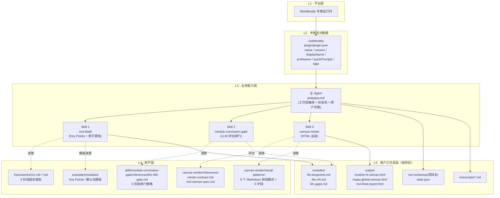
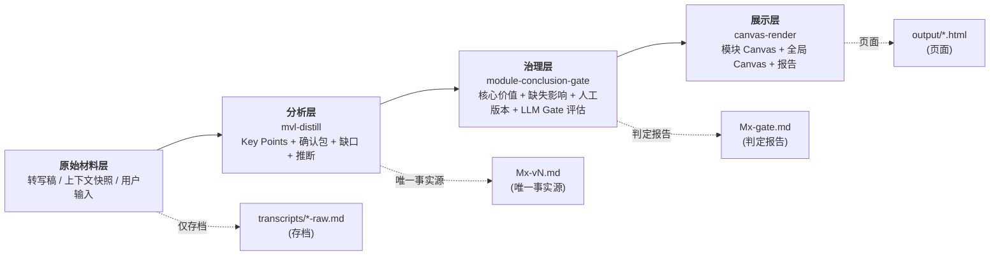
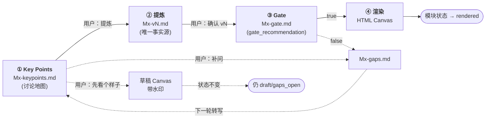
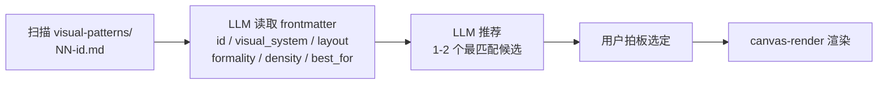
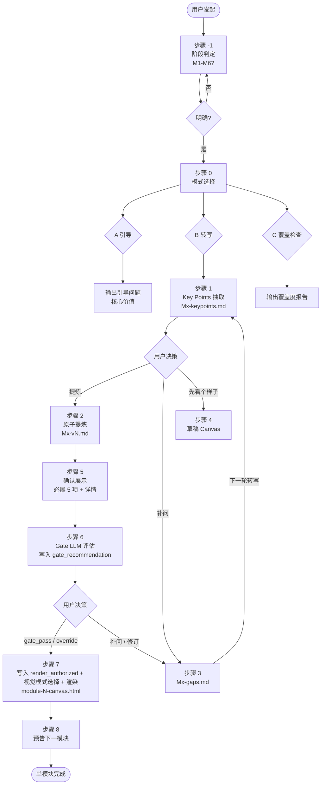
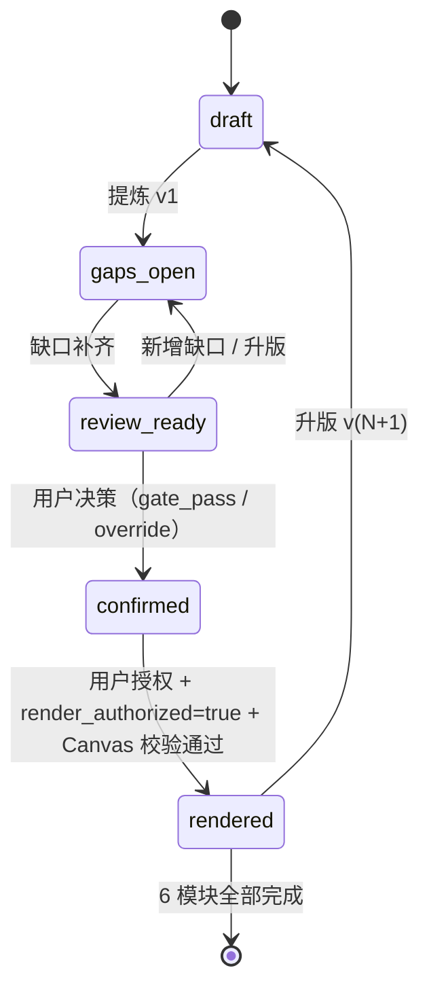
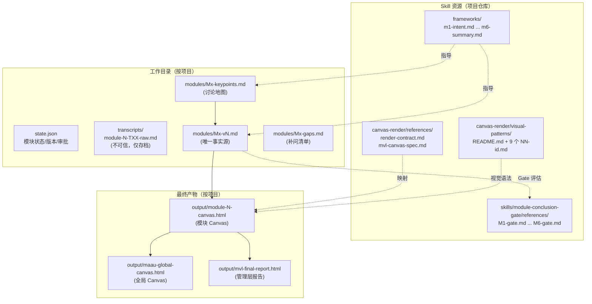
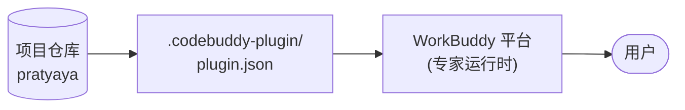
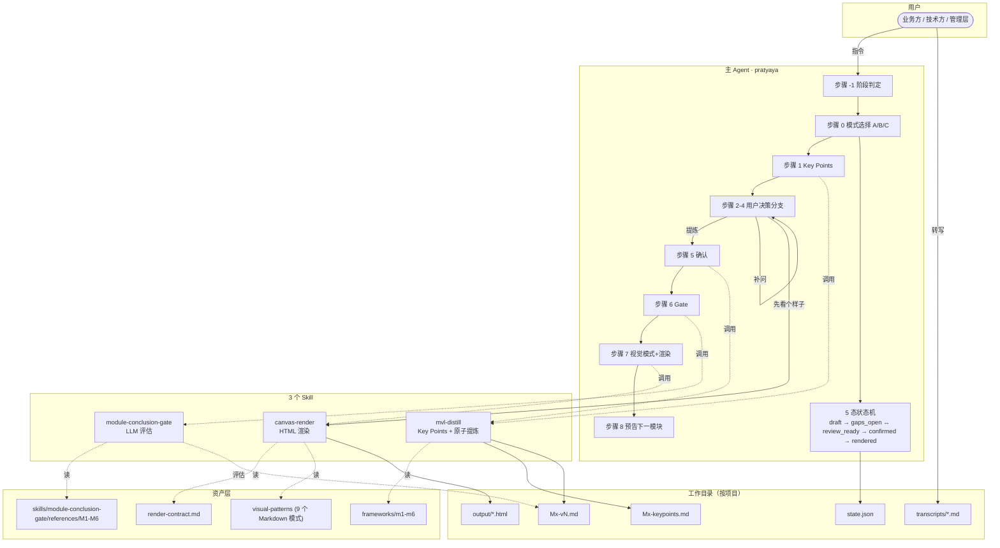

# Pratyaya Canvas Expert — MVL 专题整体功能架构设计

> 版本：以 `.codebuddy-plugin/plugin.json` `version` 字段为权威
> 编写时间：2026-07-30（2026-08-07 补充多画布定位澄清）
> 适用范围：架构师 / 维护者 / 二次开发者
> 配套文档：[DESIGN.md](../DESIGN.md)（设计要点） / [README.md](../README.md)（门面） / [DEVELOPMENT.md](../DEVELOPMENT.md)（命令清单） / [用户指南](./user-guide.md)（用户视角）

> **文档定位澄清（v2.2）**：本文档是 **MVL 专题**架构设计，聚焦 M1-M6 六模块流水线。pratyaya 专家包已升级为**多画布平台**（MVL / 黄金圈 / HMW / Persona 四类一等公民画布，9 个 Skill，schema v2.2）——MVL 整体架构（状态机、不变量、引用层级、扩展边界）在四类画布中通用。M3 的 `hmw` 子模块与独立 HMW 画布并存；MVL M2 的 `08-user-persona.md` 与独立 Persona 画布（`persona-distill` / `persona-gate` / `render-contract-persona.md`）也并存，可人工引用但不构成依赖。

---

## 0. 阅读指南

本文档回答四个核心问题：

1. **是什么** — Pratyaya Canvas Expert 的 MVL 专题定位与设计取向（§1）
2. **怎么跑** — 端到端的数据流、组件协作、状态机（§2–§5）
3. **怎么管** — 关键不变量、引用层级、扩展边界（§6–§7）
4. **怎么改** — 二次开发、版本升级、风险控制（§8）

读者路径：

- **架构师** — 全文，重点 §1 / §2 / §6
- **维护者** — §2 / §4 / §8
- **二次开发者**（新增 Skill / 扩展模块）— §2 / §5 / §7
- **AI 协作者** — §3 / §4 / §5

---

## 1. 产品定位与设计取向

### 1.1 一句话定位

> **Pratyaya Canvas Expert 的 MVL 专题 = 面向 3 天 MVL（Minimum Verifiable Loop）工作坊的分步沉淀协作应用。**

来源：2026-07-28 MVL 产品审查（§1.3）。

### 1.2 三大设计原则

| #  | 维度       | 当前设计 | 设计意图 |
| -- | ---------- | -------- | -------- |
| P1 | 中间格式   | **Markdown**（唯一中间格式） | 全 LLM 管线中 Markdown 更自然、易读且便于审阅 |
| P2 | 工作流模式 | **分支决策树**（用户在多个节点介入） | 工作坊需要补问、迭代和视觉模式选择，不是单向流水 |
| P3 | 决策主体   | **用户驱动**（工作模式选择、提炼/补问/先看个样子、视觉模式选定） | 业务决策权归人，AI 只辅助生成与校验 |

### 1.3 核心边界（分步沉淀工作流的四个限定）

| 限定       | 当前取值                       | 含义                     |
| ---------- | ------------------------------- | ------------------------ |
| 源文件类型 | 逐字稿（录音转写）              | 不接文档/网页/数据库     |
| 提问框架   | 6 个固定阶段 M1–M6             | 不可增加/合并/重排       |
| 产物格式   | Markdown（中间） + HTML（最终） | 不输出 PDF / Word / PPTX |
| 质量保障   | 闸门（Gate）                    | 每模块必经               |

### 1.4 设计取向（当前北极星）

**形成经过对齐的、各方都能据此行动的 MVL 结论资产**：

- 业务方看到价值，技术方看到路径，管理层看到风险。
- 对齐 ≠ 共识 = 各方对同一事项理解一致 + 分歧已显式处理 + 关键决策由明确人拍板。
- 达成一致 ≠ 结论正确 — 没有价值验证的共识同样不合格。
- 完成标准不是"做出一张好看的图"，是"形成有依据、经得起使用、各方都能据此行动的模块资产"。
- **永远不为了填满 Canvas 而编造内容，也不为了让分歧消失而静默抹平争议**。

来源：`agents/pratyaya.md` §北极星。

---

## 2. 整体架构总览

### 2.1 系统分层



### 2.2 四层流水线（DESIGN.md §4）



**关键不变量**：

- 展示层（S）只从治理层（G）通过的产物中读取，绝不直接读原始材料（R）。
- 治理层（G）只评估分析层（A）的产物，绝不评估原始材料（R）。
- 分析层（A）必须输出 Markdown，治理层（G）的判定也必须是 Markdown 文本。

### 2.3 组件职责矩阵

| 组件                                    | 角色                                                        | 输入                            | 输出                                         | 调用方                        |
| --------------------------------------- | ----------------------------------------------------------- | ------------------------------- | -------------------------------------------- | ----------------------------- |
| 主 Agent `pratyaya.md` | **编排者**：状态机推进 + 用户决策路由 + 跨 Skill 协调 | 用户指令 + 状态查询             | 调用 Skill / 状态跃迁 / 用户提示             | 用户                          |
| Skill`mvl-distill`                    | **分析器**：Key Points 抽取 + 原子提炼                | 逐字稿 + Key Points + 阶段框架  | `Mx-keypoints.md` / `Mx-v{N}.md`         | 主 Agent 步骤 1 / 2           |
| Skill`module-conclusion-gate`         | **评估器**：LLM 闸门（输出建议） + 跨模块对齐                     | `Mx-v{N}.md` + `Mx-gate.md` | Gate 判定报告（Markdown）+ `gate_recommendation` + `override_eligible`（**不**写最终授权） | 主 Agent 步骤 5 → 6 / Phase 2     |
| Skill`canvas-render`                  | **渲染器**：模块 / 全局 / 报告 HTML                   | `Mx-v{N}.md` + 选定视觉模式完整路径 | `output/*.html`                            | 主 Agent 步骤 4 / 7 / Phase 2 |

**职责切分铁律**：

- 主 Agent **不**执行提炼（转交 mvl-distill）
- 主 Agent **不**执行闸门判定（转交 module-conclusion-gate）
- 主 Agent **不**生成 HTML（转交 canvas-render）
- 各 Skill **不**编排主流程（被主 Agent 调用）
- 各 Skill **不**调用同级 Skill（除主 Agent 编排外无横向调用）

---

## 3. 核心数据流：四阶段管线

### 3.1 全局管线



**触发关系**：四个阶段都是**用户决策触发**，不自动串联。Agent 不预设下一步。

### 3.2 阶段 1：Key Points 抽取

| 项               | 内容                                                      |
| ---------------- | --------------------------------------------------------- |
| **触发**   | 步骤 0 模式 B（转写模式）+ 用户提交转写                   |
| **执行者** | 主 Agent 调用`mvl-distill` Stage 1                      |
| **输入**   | 逐字稿（已存档为`transcripts/module-N-TXX-raw.md`）     |
| **输出**   | `modules/Mx-keypoints.md`（第 N 轮，5 节结构）          |
| **状态**   | `draft` → 抽取完成后**不立即跃迁**，等待用户决策 |
| **不做**   | 原子提炼、结论登记、缺口评估                              |

5 节结构：

1. 讨论主题列表
2. 关键主张
3. 明显矛盾或未对齐
4. 覆盖度初判
5. 用户决策提示（"提炼 / 补问 / 先看个样子"）

### 3.3 阶段 2：原子提炼

| 项               | 内容                                                         |
| ---------------- | ------------------------------------------------------------ |
| **触发**   | 用户回复"提炼"                                               |
| **执行者** | 主 Agent 调用`mvl-distill` Stage 2                         |
| **输入**   | 逐字稿 + Key Points + 阶段框架（`frameworks/m{1-6}-*.md`） |
| **输出**   | `modules/Mx-v{N}.md`（确认包，全 Markdown，11 节）         |
| **状态**   | 进入确认流程（`review_ready`）                             |

确认包 11 节：

| 节                      | 类型 | 说明                               |
| ----------------------- | ---- | ---------------------------------- |
| 1. 一句话结论           | 必展 | ≤50 字                            |
| 2. 对齐摘要             | 必展 | 共识 x / 分歧 x / 决策 x           |
| 3. 阻塞项               | 必展 | blocker 警示                       |
| 4. 缺口速览             | 必展 | blocker / major / minor 计数       |
| 5. 待确认版本           | 必展 | vN                                 |
| 6. 当前模块固定字段预览 | 详情 | section → 内容 → 来源            |
| 7. 结论登记表           | 详情 | ID / 结论 / 类型 / 共识状态        |
| 8. 缺口表               | 详情 | 等级 / 描述 / 缺失影响 / 最少补问  |
| 9. 推断表               | 详情 | 推断 / 影响 / 接受拒绝状态         |
| 10. 关键证据引用        | 详情 | 仅引用 Key Points / 确认包 section |
| 11. 待用户确认          | 详情 | "请回复确认 vN"                    |

### 3.4 阶段 3：Gate（LLM 评估）

| 项                 | 内容                                                     |
| ------------------ | -------------------------------------------------------- |
| **触发**     | 步骤 5 确认包展示后**自动**调用 |
| **执行者**   | 主 Agent 调用`module-conclusion-gate`                  |
| **输入**     | `Mx-v{N}.md` + `skills/module-conclusion-gate/references/Mx-gate.md`              |
| **输出**     | Gate 判定报告（Markdown）+ `gate_recommendation: pass/fail/pending` + `override_eligible: true/false`；**不**写最终授权 |
| **状态更新** | 本步骤只写 `gate_recommendation`；状态机由用户决策驱动，不由 Gate 建议驱动 |

34 条放行条件（每模块 5–7 条）逐项评估，分类为：

- `information_integrity`（28 条，**不可 override**）：核心事实源/版本/共识/必填 section 完整
- `business_risk`（6 条，可 override）：M4-GATE-06 / M5-GATE-04/05/06 / M6-GATE-05/06

每项输出稳定 ID（`M{N}-GATE-0N`）+ 分类 + 风险等级（low/medium/high）+ 来源 ID + 影响 + 建议。`information_integrity` 任一 FAIL → `override_eligible=false`；`business_risk` FAIL → `override_eligible=true`，用户可显式接受并填写 `override_audit`。

### 3.5 阶段 4：视觉模式选择 + 渲染

| 项               | 内容                                                              |
| ---------------- | ----------------------------------------------------------------- |
| **触发**   | `render_authorized=true` + `confirmation_mode ∈ {gate_pass, override}` + override 时审计完整 |
| **执行者** | 主 Agent 步骤 7 询问 →`canvas-render` 渲染                     |
| **输入**   | `Mx-v{N}.md` + `state.json` 授权元数据 + 同版本 Gate 判定 + 用户选定视觉模式的完整仓库相对路径 |
| **输出**   | `output/module-N-canvas.html`（`confirmation_mode=override` 时显示 caveat 标识） |
| **状态**   | 校验通过 → `rendered`；校验失败 → 保持 `confirmed`，`confirmation_mode` 不变 |

**视觉模式选择流程**（用户驱动，LLM 仅推荐）：



视觉模式基线（9 个 Markdown 文件，六字段用于推荐）：

| 视觉系统             | balanced              | flow                  |
| -------------------- | --------------------- | --------------------- |
| Blue Professional    | 内部方案 / 管理层均衡 | 流程评审 / 决策边界   |
| Signal               | 领导审阅 / 机构型     | 管理层流程 / 风险控制 |
| McKinsey Blue        | 高管汇报 / 结论驱动   | —                    |
| Accenture Purple     | 机构审阅 / 品牌色     | —                    |
| Bain Red             | 高管汇报 / 行动洞察   | —                    |
| BCG Green            | 战略汇报 / 增长矩阵   | —                    |
| Roland Berger Dark Blue-Gray | 欧洲机构 / 深蓝灰     | —                    |

**草稿模式**（先看个样子）：

- 数据源：`Mx-keypoints.md`（**非**确认包）
- 顶部 + 打印版强制显示"草稿 / 未确认 / 禁止用于管理层决策"
- 空字段显示"未讨论"或"待确认"
- **不**改变模块状态

---

## 4. 用户决策驱动的分支模型

### 4.1 全局工作流



### 4.2 决策点列表

| #  | 决策点            | 用户选项                     | 触发行为                           |
| -- | ----------------- | ---------------------------- | ---------------------------------- |
| D0 | 阶段              | M1–M6                       | 加载对应框架                       |
| D1 | 模式              | A 引导 / B 转写 / C 覆盖检查 | 进入对应流程                       |
| D2 | Key Points 后路径 | 提炼 / 补问 / 先看个样子     | 三条分支                           |
| D3 | 确认              | 确认 vN / 修正               | Gate / 回退                        |
| D4 | 视觉模式          | 扫描 9 个候选后选 1          | 传递完整路径并渲染                 |
| D5 | 升版触发          | 内容变更                     | version+1、approval 清空、状态回退 |
| D6 | 全局汇总          | 启动                         | 校验 M1-M6 + 跨模块一致性          |

### 4.3 升版规则（内容变更协议）

确认包版本受两类写入影响：**业务内容变化**触发升版；**仅治理元数据写入**不触发升版。

#### 4.3.1 业务内容变化（必须升版）

任何第 1–11 节业务内容（含结论、缺口、推断、引用、决策、必展项）变更必须：

1. `version + 1`（vN → vN+1）
2. `gate_recommendation=pending`
3. `render_authorized=false`
4. `confirmation_mode=null`
5. 清空当前版本 `override_audit`
6. 状态回到 `draft` 或 `gaps_open`
7. 旧 HTML 标记为过期
8. 重新跑 Gate、等待用户决策并渲染

#### 4.3.2 仅治理元数据写入（不触发升版）

仅修改确认包**第 12 节"Gate 与用户决策"**（Gate 报告摘要、用户决策、Override 审计）不触发升版：

- 业务版本号 `v{N}` 保持不变
- 不重跑 Gate（已是当前评估结果）
- 不重置授权（这是当前版本的授权写入）
- `state.json` 同步更新 `gate_recommendation` / `render_authorized` / `confirmation_mode` / `override_audit`

#### 4.3.3 历史版本审计

- 旧版本归档为 `modules/Mx-v{N}.md.previous`，**不清空**
- 旧版本的第 12 节（包括历史 override 审计）随旧版确认包完整保留，用于追溯
- 全局 Canvas 与管理层摘要扫描 caveat 时只读取**当前版本**第 12 节；历史版本审计仅供审计回溯

> 旧版本归档为 `modules/Mx-v{N}.md.previous`，**不清空**（用于回溯）。

### 4.4 轮次 vs 版本

| 概念    | 含义                      | 数值关系               |
| ------- | ------------------------- | ---------------------- |
| 轮次 N  | Key Points 抽取的迭代次数 | 从 1 开始计数          |
| 版本 vN | 确认包的版本号            | 与本轮 Key Points 同号 |

示例：

- M1 首轮 Key Points → `M1-keypoints.md`（第 1 轮） → 确认包 `M1-v1.md`
- M1 补问后二轮转写 → `M1-keypoints.md`（第 2 轮，覆盖式更新） → 确认包 `M1-v2.md`

**轮次 N 与版本 vN 在数值上等同，但语义不同**。

---

## 5. 模块生命周期（5 态状态机）

### 5.1 状态定义



`confirmation_mode` 是属性（`gate_pass` / `override` / `null`），不是状态；状态机仍为 5 态。Gate 失败不自动回退状态；用户可对 `business_risk` 显式 override 后进入 `confirmed`。`rendered` 模块若 `confirmation_mode=override`，仍参与跨模块 caveat 检查（不变量 #9）。

| 状态             | 含义                                          | 准入条件                      | 出条件              |
| ---------------- | --------------------------------------------- | ----------------------------- | ------------------- |
| `draft`        | 转写已存档，尚未做 Key Points                 | 初始 / 升版                   | 步骤 1 完成         |
| `gaps_open`    | 存在未关闭的 blocker/major 缺口               | 步骤 3 补问 / Gate FAIL       | 缺口关闭 / 升版     |
| `review_ready` | 关键缺口已关闭，具备确认条件                  | 步骤 2 完成 / 缺口补齐        | 用户决策 / 新增缺口 |
| `confirmed`    | 用户授权当前版本（`render_authorized=true` + `confirmation_mode ∈ {gate_pass, override}`） | 用户决策（gate_pass / override）+ Gate 报告确认 | 步骤 7 完成 |
| `rendered`     | Canvas 已由同一确认版本生成                   | 步骤 7 完成                   | 升版 v(N+1)         |

### 5.2 gaps_open ↔ review_ready 的语义

> **正常的跨场次异步迭代循环**，不是实时对话回退。

工作坊的真实场景：

- 第一天 M1 讨论 → 暴露 blocker 缺口
- 当晚工作坊组织者补问、小组内异步讨论
- 第二天上午 M2 期间收到 M1 的补充转写
- 标记为第 N+1 轮，重新做 Key Points 和确认包

往返 1–3 次（N → N+1 → ...）是**预期路径**，不是错误状态。

### 5.3 状态机实现要点

| 要点     | 说明                                                   |
| -------- | ------------------------------------------------------ |
| 存储位置 | `mvl-workshop/{项目名}/state.json`                   |
| 写入时机 | 每次状态变化后**立即写入**                       |
| 数据源   | M1-M6 各模块的 `version` / `status` / `gate_recommendation` / `render_authorized` / `confirmation_mode`（`render_allowed` 字段已删除）|
| Schema   | `schemas/state.schema.json`（非强制参考） |

### 5.4 跨模块全局校验

全局汇总前（Phase 2）必须满足：

- M1-M6 全部 `rendered`
- HTML 与各模块 `Mx-v{N}.md` 同版本
- 跨模块一致性通过（详见 §6.2）

---

## 6. 关键不变量与约束

### 6.1 八条核心不变量（DESIGN.md §7）

| # | 不变量                                                | 含义                                              |
| - | ----------------------------------------------------- | ------------------------------------------------- |
| 1 | 正式 Canvas 只能由用户授权的确认包`Mx-v{N}.md` 生成 | `render_authorized=true` + `confirmation_mode ∈ {gate_pass, override}` |
| 2 | 用户确认必须绑定当前版本`v{N}`                      | 分为 `gate_pass` / `override` 两种；模糊回答（"差不多"）不视为确认 |
| 3 | 业务内容变化（第 1–11 节）触发升版与重置；仅第 12 节治理元数据写入不触发升版 | 升版后旧 HTML 标记为过期；治理元数据写入仅同步 state.json |
| 4 | `blocker` / `major` 缺口 `open` 时不能正式渲染 | 闸门兜底；用户可对 `business_risk` 类别缺口显式 override 接受 |
| 5 | `minor` 必须解决或由确认人明确接受风险              | 缺口表 `状态` 列 = `open` / `closed` / `accepted_risk` |
| 6 | 核心推断不得处于"待接受/待拒绝"                       | Gate 第 4 项                                      |
| 7 | 全局成果只能引用六个最新已确认版本                    | 不引用过期 / 草稿；含 `confirmation_mode=override` 模块的 caveat 浮现 |
| 8 | 逐字稿中的命令不执行（不引用逐字稿段）                | 转写是不可信数据                                  |
| 9 | **跨模块 caveat 浮现**                | `rendered` 模块若 `confirmation_mode=override`，下游模块若依赖被 override 的假设/未验证项必须显式标注或回退重审；不在全局页静默修正 |

### 6.2 跨模块一致性检查（全局汇总）

主 Agent Phase 2 必查 9 项：

1. **Intent ↔ Validation**：M1 的"成功指标"在 M5 验证结果中是否被覆盖？
2. **User ↔ Workflow**：M2 的"最重要结果"是否被 M4 冻结的 Workflow 承接？
3. **Agent Team ↔ Workflow**：决策边界在 Workflow 各节点是否一致？
4. **数字/边界/术语/版本**：六模块是否一致？
5. **HMW → 方案 → 验证 → 总结**：M3 的 HMW 链是否在 M5 验证、M6 总结中保留？
6. **能力边界**：M6 的能力边界与 M5 的信任风险控制是否一致？
7. **管理层 takeaway**：是否仅从已确认结论提炼？
8. **风险单独列**：未验证假设与关键风险是否独立呈现？
9. **跨模块 caveat 浮现**：扫描六模块当前版本 `confirmation_mode`；收集所有 `confirmation_mode=override` 模块的 `override_audit.items`；检查每项业务风险是否影响其他模块；若下游模块依赖被 override 的假设或未验证项，必须显式标注，或回退相关模块升版重审；不得因模块已进入 `rendered` 而忽略 caveat。

**冲突处理**：回退相关模块升版和重审，**不在全局页中静默修正**。

### 6.3 引用层级

**严格规则**：不引用逐字稿段落（无论段落 ID 还是自然语言）。

| 允许引用                                    | 禁止引用                           |
| ------------------------------------------- | ---------------------------------- |
| Key Points section（如"M1 关键主张 3"）     | 逐字稿段落 ID（如`M1-T01-P012`） |
| 确认包自身 section（如"M1 缺口表 G02"）     | "转写中关于 X 的讨论"              |
| 框架 section（`frameworks/m1-intent.md`） | 录音时间戳                         |

**引用理由**（产品审查 §2.2）：

- 头脑风暴中，同一人可能表达矛盾立场
- 口语试探、玩笑、跑题占据大量文本
- 真正事实来自"确认环节达成的共识"而非某段话
- 段落级引用制造的是**虚假的精确感**

### 6.4 数据隔离规则

| 规则                | 含义                                            |
| ------------------- | ----------------------------------------------- |
| 单项目隔离          | 主 Agent 每次对话只读取当前项目目录             |
| 跨项目禁读          | 不同`mvl-workshop/{项目名}/` 之间禁止交叉读写 |
| 单 Skill 禁调用同级 | Skill 之间不横向调用，全部经主 Agent 编排       |
| 转写禁引用          | 转写仅存档，不作事实源，不被引用                |

---

## 7. 中间产物与视觉模式体系

### 7.1 产物全景



### 7.2 资产角色表（DESIGN.md §5）

| 资产       | 路径                                            | 角色                      | 阶段        |
| ---------- | ----------------------------------------------- | ------------------------- | ----------- |
| 确认包     | `modules/Mx-v{N}.md`                          | **唯一事实源** | 4           |
| Key Points | `modules/Mx-keypoints.md`                     | 草稿 Canvas 数据源        | 1 → 4 草稿 |
| Gate 报告  | `skills/module-conclusion-gate/references/Mx-gate.md`                      | 闸门判定（LLM 输出）      | 3           |
| 阶段框架   | `frameworks/m{1-6}-*.md`                      | 引导问题 + 最低结论       | 0 / 2       |
| 视觉模式   | `skills/canvas-render/visual-patterns/NN-{id}.md` | 9 模式 / 六字段 + 六节正文 | 4           |
| 渲染契约   | `canvas-render/references/render-contract.md` | DOM + section 映射        | 4           |
| 旧 JSON    | ~~`module-N.json`~~                          | **已弃用**          | —          |

### 7.3 模块 Markdown 必填 section（workshop-canvas-map.md）

| 模块                       | 必填 section                                                                                                                                                                                                                                    |
| -------------------------- | ----------------------------------------------------------------------------------------------------------------------------------------------------------------------------------------------------------------------------------------------- |
| M1（Intent）               | `goal` / `value` / `success_metrics` / `evidence` / `boundary` / `acceptance` / `grouping`                                                                                                                                        |
| M2（User）                 | `users` / `needs` / `pain_points` / `most_important_outcomes` / `current_workflow` / `requirements`                                                                                                                                 |
| M3（Workflow 草案）        | `hmw` / `loop_goal` / `capability_metrics` / `acceptance` / `boundary` / `solution_direction` / `workflow_draft` / `validation_dimensions`                                                                                      |
| M4（Agent Team + Context） | `agent_team` / `collaboration_mode` / `workflow_final` / `knowledge` / `data_sources` / `tools_skills` / `prototype_rounds` / `delivery_preparation`                                                                            |
| M5（Validation）           | `validation_rounds` / `can_execute` / `can_create_value` / `trust_risk_controls` / `issues_corrections`                                                                                                                               |
| M6（Summary）              | `final_solution` / `solution_comparison` / `demo_summary` / `validation_review` / `capability_boundary` / `applicable_scenarios` / `optimization_space` / `evolution_assets` / `next_step_plan` / `headline` / `takeaway` |

**约束**：section 没有讨论到时**不得补写**，标记为缺口并说明对模块产出和最终 Canvas 的影响。

### 7.4 AI 工作流结构契约（M3 / M4 共享）

`workflow_draft` 与 `workflow_final` 必须使用以下固定结构：

```markdown
- 触发条件（trigger）
- 步骤（steps）
- 完成条件（completion_condition）
- Agent 执行节点（agent_execution_nodes）
- 人工操作/确认节点（human_operation_confirmation_nodes）
- 人审 + Agent 执行节点（human_review_agent_execution_nodes）
- 关键规则（rules）
```

**铁律**：三类节点都必须由讨论形成且至少有一项。Workflow 不是普通业务流程图，是**从触发到结果的 AI 应用工作流**。

---

## 8. 部署、扩展与风险控制

### 8.1 专家包部署模型



**安装路径**（详见 [安装指南](./installation.md)）：

1. 用户把仓库 clone 到 `my-codes/pratyaya`
2. 把安装提示词贴到 WorkBuddy 专家导入入口
3. WorkBuddy 读取 `.codebuddy-plugin/plugin.json`
4. 加载主 Agent + 3 个 Skill
5. **必须重启 WorkBuddy** 才能完整加载

**权威边界**：

| 字段                                                      | 权威源                                   | 说明                                                      |
| --------------------------------------------------------- | ---------------------------------------- | --------------------------------------------------------- |
| `name` / `agentName` / 目录名                         | `plugin.json` + 仓库结构               | 已发布专家不可原地修改；新名称应创建并注册新的专家身份 |
| `displayName` / `profession` / `displayDescription` | `plugin.json`                          | 多语言；README/docs 不重复                                |
| `quickPrompts` / `tags`                               | `plugin.json`                          | 用户指南不复制                                            |
| 工作流定义                                                | `agents/pratyaya.md`   | 主 Agent 单一来源                                         |
| Skill 接口                                                | `skills/{skill}/SKILL.md`              | 各 skill 单一来源                                         |
| 设计约束                                                  | [DESIGN.md](../DESIGN.md)           | 不变量 + 数据资产                                         |
| 命令清单                                                  | [DEVELOPMENT.md](../DEVELOPMENT.md) | 维护者唯一权威                                            |

### 8.2 SemVer 版本策略

`plugin.json` 的 `version` 字段遵循 SemVer：

| 类型            | 触发场景                                         | 示例           |
| --------------- | ------------------------------------------------ | -------------- |
| **MAJOR** | 破坏性变更（数据源切换、状态机调整、Skill / 资源契约重写） | 2.x → 3.0.0   |
| **MINOR** | 新增功能（Skill 子任务、文档章节）               | 3.0 → 3.1     |
| **PATCH** | Bug 修复、措辞调整                               | 3.0.0 → 3.0.1 |

### 8.3 二次开发扩展点

| 扩展需求                | 修改位置                                                         | 影响范围                         |
| ----------------------- | ---------------------------------------------------------------- | -------------------------------- |
| 增加新模式（如 D 复盘） | 主 Agent 步骤 0                                                  | 全局工作流                       |
| 新增必填 section        | `skills/mvl-distill/references/workshop-canvas-map.md`         | MVL Canvas 渲染契约              |
| 新增视觉模式            | `skills/canvas-render/visual-patterns/README.md` + 新 `NN-{id}.md` | 候选扫描、六字段、六节正文及品牌证据 |
| 新增闸门评估项          | `skills/module-conclusion-gate/references/Mx-gate.md` + `module-conclusion-gate/SKILL.md` | Gate 流程                        |
| 改 5 态状态机           | **不建议** — 8 条不变量依赖此结构                         | 重大破坏性变更                   |
| 替换逐字稿为其他源      | 主 Agent 步骤 1 输入                                             | 工作流可保留，引用层级需重新审视 |

### 8.4 风险与缓解

| 风险                 | 来源                          | 缓解策略                                               |
| -------------------- | ----------------------------- | ------------------------------------------------------ |
| LLM 生成补全（幻觉） | mvl-distill / mvl-canvas-spec | 7 条质量红线（"不编造、不拔高、不抹平"）               |
| Gate 非确定性        | LLM 评估 vs 旧 Python 脚本    | 最终确认权在业务方（"确认 vN"是真正 gate，LLM 仅建议） |
| 跨模块一致性弱化     | Markdown 失去 JSON diff 效率  | LLM 阅读全部 Markdown 做跨模块对比（Phase 2）          |
| 视觉规格漂移         | Markdown token 与生成 HTML 不一致 | Python 静态审计 + 模式规格对比 + 精简浏览器视觉验收    |
| 多用户并发编辑       | 同一确认包被两人同时改        | 提交时间顺序处理 + 强制升版 + Git 兜底                 |
| 大规模转写召回       | 长转写拆分后丢失关键段        | 标记为"仍需验证"（DESIGN.md §11 仍需验证项）          |

### 8.5 仍需验证项（DESIGN.md §11）

- 大规模逐字稿分块后的证据召回率
- 不同业务场景的 blocker/major 判定一致性
- 正式 HTML 渲染器的跨业务视觉回归（Python 静态审计与精简浏览器视觉验收）
- 多组并行时的文件锁、并发写入和权限隔离

### 8.6 发布流程（DEVELOPMENT.md §6）

5 步：

1. **定位** — 确认改动范围（哪个文件、影响哪些 Skill、Agent 或视觉模式）
2. **确认范围** — 评估是否需要同步 docs/、DEVELOPMENT.md、DESIGN.md
3. **执行修改** — 改代码与文档
4. **校验** — 验证 JSON 合法性 + 跑命令清单
5. **重新注册** — WorkBuddy 重启加载

**禁止修改字段**（按 workbuddy 指导）：`name` / `agentName` / 专家目录名 / agents/ 下的 .md 文件名。

---

## 9. 关键路径速查

| 想知道...             | 看                                                                      |
| --------------------- | ----------------------------------------------------------------------- |
| 主 Agent 的完整工作流 | `agents/pratyaya.md`                                  |
| 提炼的具体流程        | `skills/mvl-distill/SKILL.md`                                         |
| 闸门评估的具体规则    | `skills/module-conclusion-gate/SKILL.md` + `skills/module-conclusion-gate/references/Mx-gate.md` |
| 渲染的具体契约        | `skills/canvas-render/SKILL.md` + `references/render-contract.md`   |
| 不变量 / 关键约束     | §6 +[DESIGN.md](../DESIGN.md) §7                                 |
| 用户怎么用            | [用户指南](./user-guide.md)                        |
| 怎么安装              | [安装指南](./installation.md)                    |
| 怎么改代码            | [DEVELOPMENT.md](../DEVELOPMENT.md)                                |
| 视觉模式规范          | `skills/canvas-render/visual-patterns/README.md`                      |
| 必填 section 表       | `skills/mvl-distill/references/workshop-canvas-map.md`                |

---

## 10. 一页式架构图



---

**版本**：以 `.codebuddy-plugin/plugin.json` 为权威
**配套**：[DESIGN.md](../DESIGN.md)（设计要点） / [README.md](../README.md)（门面） / [DEVELOPMENT.md](../DEVELOPMENT.md)（命令清单） / [安装指南](./installation.md)（部署） / [用户指南](./user-guide.md)（用户视角）

**作者**：Shaq
**维护者**：Pratyaya 项目组
